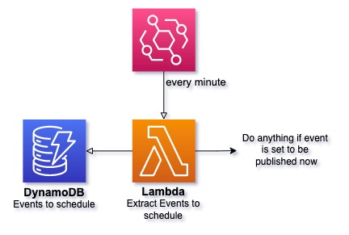
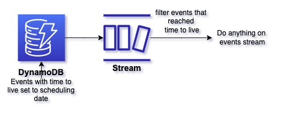
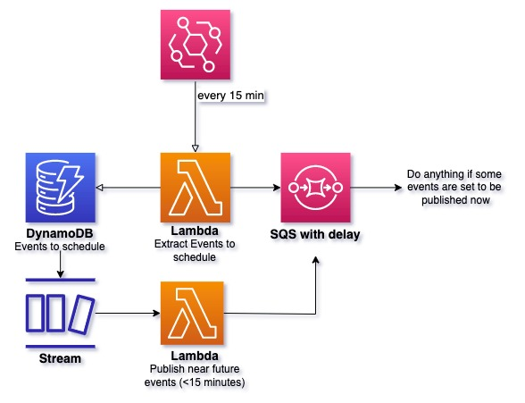

# A serverless solution to just-in-time scheduling

TLDR; We published a **CDK construct** to schedule events precisely.
Documentation is available on [the project's github](https://github.com/guiyom-e/cdk-scheduler)

When I worked on a serverless CMS with Guillaume, we had to find a way to schedule an event (publishing a new article)
at a precise time with serverless tools.
AWS doesn't offer a built-in service to do so.
We found straight-forward options but none as precise as we wished.
We came up with a solution of our own.
We published a CDK construct for you to add our solution to your stack without boilerplate.

## Naive approaches to serverless scheduling

### Scheduling a lambda to run every minute

A first approach is to use **lambda schedule trigger** feature.
Lambdas can be triggered every down to every minute.
Every minute, you can query your database to find if any events need to be published now.
If so, run the action you planned (like publishing an article), else do nothing.

A lambda can be triggered down to every minute and the trigger time has a **one-minute precision** guarantee.
It's good enough for some use-cases but not if you are looking for a highly precise method.

### Using DynamoDB time-to-live and streams

DynamoDB comes with a time-to-live feature.
You can add a **`ttl` attribute** to an entry.
At said time, AWS will remove the entry form your table.
If you have a stream plugged to your table you can play an action at scheduled time.

However, this approach is **even less precise** than the first.
AWS only guarantees a forty-eight-hour precision on the time-to-live date.
In practice, users observe a ten-minute delay but it's not guaranteed.
If, like us, you work on time-sensitive events, you will want to avoid this method.

## Introducing cdk-scheduler

To match our just-in-time ambition, we leveraged the SQS delay feature.
When publishing on an SQS queue you can set a delay that goes up to fifteen minutes.

Instead of starting a lambda every minute, we do it every fifteen minutes, which reduces fixed costs.
This method has a **one-second precision gap**!

In case you're in hurry to schedule, we also added a "near-future" handler: a second lambda is plugged on a DynamoDB stream.
It handles events that are to be scheduled in less than fifteen minutes after their creation and pushes them directly on the SQS with a delay.
This edge case is just as precise.

### Pricing

CDK-scheduler lambda calls are low
Fixed costs for lambda execution is $0.06/month.
Regarding variable costs, CDK-scheduler costs $2.50 for one million scheduled events
($1.25 to put your items in DynamoDB and $1.25 to delete them, SQS is free for the first million events).

### Comparison

| Solution               | Fixed costs (per month) | Variable costs (one million events) | Precision |
| ---------------------- | ----------------------- | ----------------------------------- | --------- |
| **CDK-schedluer**      | $0.05                   | $2.50                               | 1 second  |
| Scheduled lambda       | $0.80                   | $2.50                               | 2 minutes |
| DynamoDB Time to leave | $0                      | $2.50                               | 1 day     |

## What's next?

Our construct is now published.
Documentation is available on [our open-source repository](https://github.com/guiyom-e/cdk-scheduler).
If you would like to try it on your project run `yarn add cdk-scheduler`.
It fits the need we had when we developed a CMS like a glove.
We're now looking for your feedback.
What do you need when scheduling an event?
What configuration or features would you like to see?

---

- _Cover photo by [alexandru vicol](https://unsplash.com/@alex_vicol?utm_source=unsplash&utm_medium=referral&utm_content=creditCopyText) on Unsplash_
